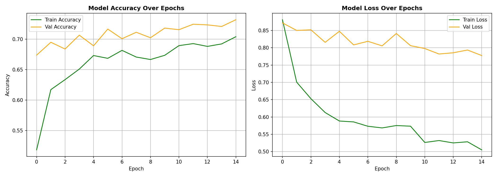

# CassavaScan_AI
Cassava disease detector AI model for African farmers.


## The Problem

Cassava is one of the most cultivated crops across Africa.
Over 800 million people depend on it, but diseases like Cassava Mosaic Disease and Brown Streak
Disease can silently destroy entire harvests before a farmer notices
anything is wrong.

The average farmer in Uganda, Nigeria, or Tanzania cannot
afford an agricultural expert. There are no labs nearby. By the time a diagnosis
is made locally, these diseases would have already caused severe crop yield loss.

That loss isn't just income, it's also loss of food. 

## The Solution

CassavaScan AI is a web app that allows a farmer or agricultural extension
worker to snap a cassava leaf and receive an **instant AI-powered
diagnosis** that identifies which of 4 major diseases are present, or
confirming the plant is healthy. This would help with early detection of these diseases,
thereby, reducing crop yield loss.

## Live Demo

> **[Try CassavaScan AI on Hugging Face Spaces](https://huggingface.co/spaces/Ukeme-creates/CassavaScan_AI)**
> *(Link will be updated after deployment)*

## Model Performance

| Metric | Value |
|---|---|
| Architecture | MobileNetV2 (Transfer Learning) |
| Training Images | 5,656 |
| Validation Accuracy | 75.3% |
| Test Classes | 5 |
| Training Platform | Google Colab T4 GPU |

### Confusion Matrix


### Per-Class Performance
| Disease | Detection Accuracy |
|---|---|
| Cassava Bacteria Blight (CBB) | 54% |
| Cassava Brown Streak Disease (CBSD) | 72% |
| Cassava Green Mottle (CGM) | 60% |
| Cassava Mosaic Disease (CMD) | 86% |
| Healthy | 79% |

The model performs strongest on CMD and Healthy, the two most common
real-world cases. Minority class detection is an area that is acknowledged to need more improvements,
requiring more labeled training data.

## Dataset

* **Source:** TensorFlow Datasets (`cassava`)
* **Origin:** Makerere AI Lab, Makerere University, Uganda
* **Images:** 9,430 real field photos crowdsourced from Ugandan farmers
* **Why this dataset:** Captured under real African farm conditions, and
  not a Western dataset mde to fit into African conditions.

**5 Classes:**
* CBB — Cassava Bacteria Blight
* CBSD — Cassava Brown Streak Disease
* CGM — Cassava Green Mottle
* CMD — Cassava Mosaic Disease
* Healthy

## Project Structure
CassavaScan_AI/
│
├── app.py                          ← Gradio web app
├── best_cassavaguard_mobilenet.h5  ← Trained MobileNetV2 model
├── CassavaAI_Training.ipynb        ← Full training notebook
├── requirements.txt                ← Dependencies
└── training_plots.png              ← Accuracy and loss curves

## How To Run Locally

```bash
# Clone the repository
git clone https://github.com/Kemi-creates/CassavaScan_AI.git
cd CassavaScan_AI

# Install dependencies
pip install -r requirements.txt

# Run the app
python app.py
```

## Technical Approach

**Transfer Learning with MobileNetV2**
- Pretrained on ImageNet (14M images, 1000 classes)
- Custom classification head added for 5 cassava disease classes
- Phase 1: Frozen base training (15 epochs)
- Phase 2: Fine-tuning top 30 layers (10 epochs)

**Data Augmentation**
- Random horizontal and vertical flips
- Random brightness adjustment
- Random contrast adjustment

**Class Imbalance Handling**
- Log-smoothed class weights applied during training
- Prevents model from over-predicting dominant Cassava Mosaic Disease class

## Future Improvements

- Expand to other African crops (maize, yam, plantain)
- Add local language support (Swahili, Yoruba, Igbo, Hausa)
- Collect more labeled data for minority disease classes

## Built By

**Ukeme Linus** — Built as a submission for the
**DevCareer × Raenest Freelancer Hackathon 2026**

## License

MIT License — free to use, modify, and distribute.
